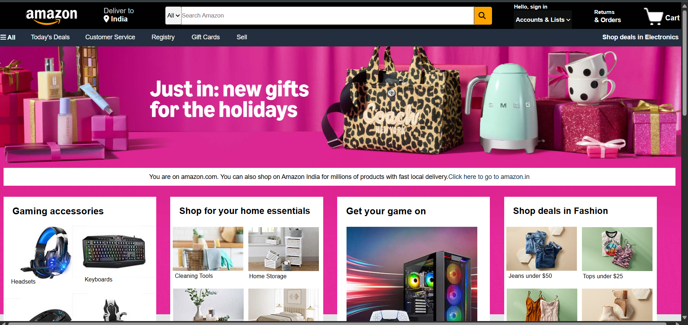

# 🛒 Amazon Frontend Clone

A frontend-only clone of the Amazon India website, built using **HTML**, **CSS**, and **JavaScript**.  
This project replicates the core look and feel of Amazon’s homepage with interactive elements.

---

## 🌟 Features
 
- 🔍 Search bar and product sections  
- 🖱️ Hover effects and clickable components  
- 🎯 Pixel-perfect sections mimicking Amazon’s UI

---

## 🛠️ Built With

- **HTML5**
- **CSS3**

---

## 📸 Preview

  

---

## 🚀 How to Run

1. Clone the repository  
   ```bash
   git clone https://github.com/AnjaliBiju/Amazon_frontend_clone.git
